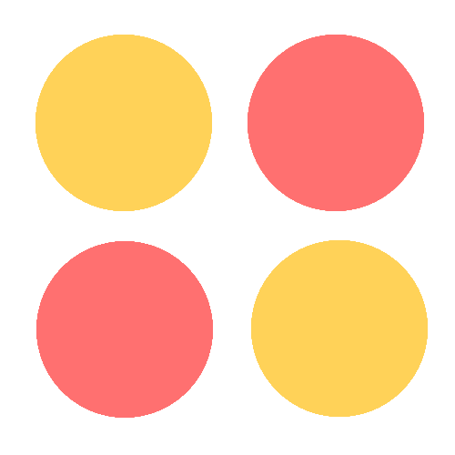
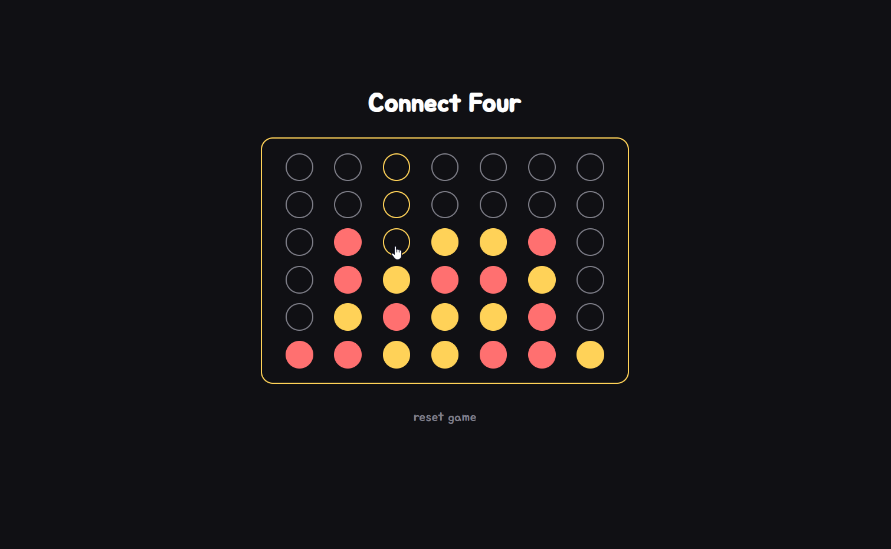

<!-- TITLE -->
<div align="center">

<p>
<h1>Connect Four</h1>
<p>A mini day project - get four in a row to win!
</p>

<p>Built with <a href="https://reactjs.org/">React</a>, CSS</a>/<a href="https://sass-lang.com/">Sass</a>, and hosted with <a href="https://www.netlify.com/">Netlify</a></p>

<b><a href="http://ahhreggi-connect-four.netlify.app/" target="_blank">
» View Live Site «
</a></b>



</div>

<!-- INSTALLATION -->

## 🛠 Installation

The project is live
<b><a href="http://ahhreggi-connect-four.netlify.app/" target="_blank">here</a></b>, but if you would prefer a local installation:

1. Clone or download this repository
   ```
   git clone https://github.com/ahhreggi/connect-four
   ```
2. Navigate to the project directory and install dependencies
   ```
   cd connect-four
   npm install
   ```
3. Launch the development web server
   ```
   npm start
   ```
4. Visit <a href="http://localhost:3000/">http://localhost:3000/</a> on your browser
